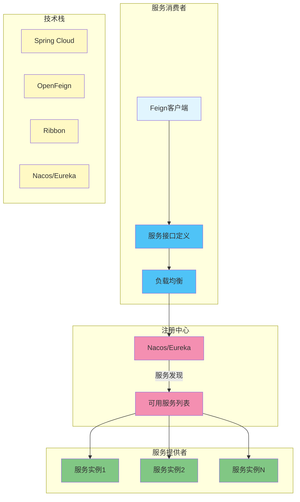
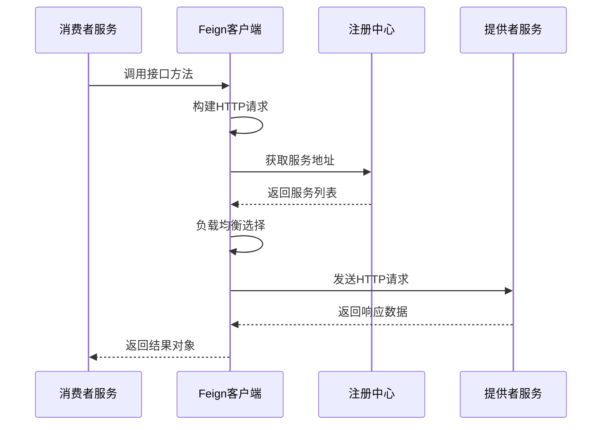
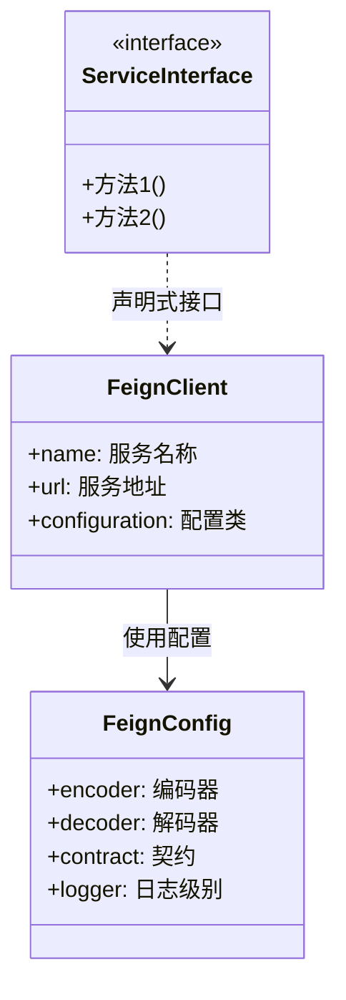

# test-springFeign

Spring Cloud Feign声明式服务调用测试项目。

## 项目架构

```mermaid
graph TB
    subgraph 服务消费者
        A[Feign客户端] --> B[服务接口定义]
        B --> C[负载均衡]
    end

    subgraph 注册中心
        C --> D[Nacos/Eureka]
        D -->|服务发现| E[可用服务列表]
    end

    subgraph 服务提供者
        E --> F[服务实例1]
        E --> G[服务实例2]
        E --> H[服务实例N]
    end

    subgraph 技术栈
        I[Spring Cloud]
        J[OpenFeign]
        K[Ribbon]
        L[Nacos/Eureka]
    end

    style A fill:#e1f5fe
    style B fill:#4fc3f7
    style C fill:#4fc3f7
    style D fill:#f48fb1
    style E fill:#f48fb1
    style F fill:#81c784
    style G fill:#81c784
    style H fill:#81c784
    style I fill:#fff9c4
    style J fill:#fff9c4
    style K fill:#fff9c4
    style L fill:#fff9c4
```

## Feign调用流程

```mermaid
sequenceDiagram
    participant C as 消费者服务
    participant F as Feign客户端
    participant R as 注册中心
    participant P as 提供者服务

    C->>F: 调用接口方法
    F->>F: 构建HTTP请求
    F->>R: 获取服务地址
    R-->>F: 返回服务列表
    F->>F: 负载均衡选择
    F->>P: 发送HTTP请求
    P-->>F: 返回响应数据
    F-->>C: 返回结果对象
```

## Feign配置结构

```mermaid
classDiagram
    class FeignClient {
        +name: 服务名称
        +url: 服务地址
        +configuration: 配置类
    }
    
    class FeignConfig {
        +encoder: 编码器
        +decoder: 解码器
        +contract: 契约
        +logger: 日志级别
    }
    
    class ServiceInterface {
        <<interface>>
        +方法1()
        +方法2()
    }
    
    FeignClient --> FeignConfig : 使用配置
    ServiceInterface ..> FeignClient : 声明式接口
```