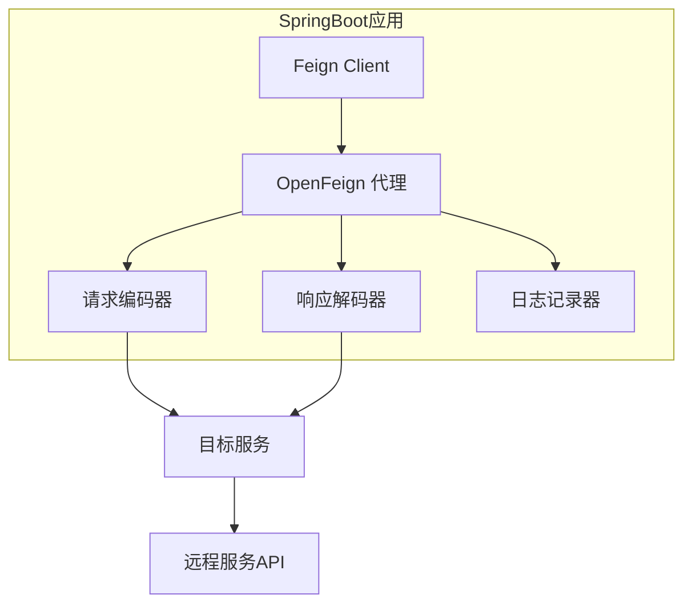

# test-springFeign

Spring Feign 客户端测试项目，演示如何使用 OpenFeign 进行服务间 HTTP 调用。

## 技术栈

| 技术 | 版本 | 说明 |
|------|------|------|
| Spring Boot | 3.x | 后端框架 |
| Spring Cloud OpenFeign | 4.x | HTTP 客户端 |
| Java | 25 | JDK 版本 |
| Maven | 3.x | 构建工具 |

## 项目架构



## 功能介绍

- **声明式 HTTP 客户端**：通过接口注解定义远程服务调用
- **负载均衡**：集成 Ribbon 实现服务负载均衡
- **降级熔断**：集成 Hystrix 实现服务降级

## 快速开始

```bash
# 编译
mvn clean compile

# 运行
mvn spring-boot:run
```

## 构建信息

```bash
mvn clean package
```
