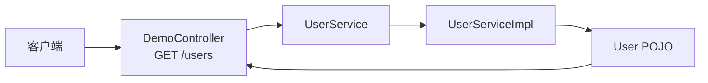

# SPEC.md - test-springFeign

## 1. 项目概述

- **项目名称**: test-springFeign
- **项目类型**: Spring Boot Web 应用
- **核心功能**: Spring Cloud Feign 声明式服务调用测试项目（演示用）
- **目标用户**: 学习 Feign 服务调用的开发者

## 2. 技术栈

| 组件 | 版本 |
|------|------|
| Spring Boot | 3.4.4 |
| Java | 25 |
| Lombok | 1.18.40 |
| Spring Web | 由 Spring Boot 3.4.4 管理 |

## 3. 功能规格

### 3.1 核心功能

- **REST API**: 提供用户列表查询接口
- **模拟数据**: 使用流生成模拟用户数据
- **服务接口**: 定义 User 实体和 UserService 接口

### 3.2 项目结构

```
src/main/java/wo1261931780/testspringFeign/
├── TestSpringFeignApplication.java         # Spring Boot 启动类
├── web/
│   └── DemoController.java                 # REST 控制器
├── service/
│   ├── UserService.java                    # 服务接口
│   └── impl/
│       └── UserServiceImpl.java            # 服务实现
└── pojo/
    └── User.java                           # 用户实体类
```

### 3.3 API 接口

| 接口 | 方法 | 路径 | 说明 |
|------|------|------|------|
| 用户列表 | GET | /users | 返回 10 个模拟用户 |

### 3.4 架构图



## 4. 配置信息

- **Java 版本**: 25
- **编码格式**: UTF-8
- **端口**: 默认 8080

## 5. 升级记录

- **2026-04-23**: 升级到 Spring Boot 3.4.4, Java 25, Lombok 1.18.40
  - 升级 Spring Boot 从 3.2.5 到 3.4.4
  - 升级 Java 从 17 到 25
  - 添加 Lombok 1.18.40 依赖和注解处理器配置
  - 添加 maven-compiler-plugin 配置

## 6. 编译信息

- **Maven 编译**: 通过
- **打包方式**: JAR

## 7. 备注

- 项目并未实际使用 Feign 依赖，仅作为演示项目
- .gitignore 状态: 完整
